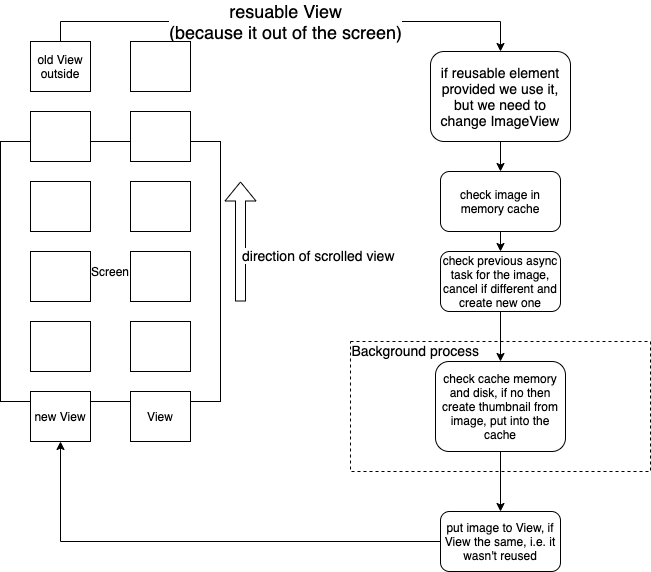

# Android gallery photo scroller

## What is it?

This is android application, that shows all your photos in *GridView*. Photo gallery uses:
* *AsyncTask*
* LRU disk and memory caches
* reused elements in *GridView* adapter to make if more efficiently

In overall it provides smooth scrolling of photos.
And it do it efficiently. Demonstration of the application:


# Table of Contests

- [What is it?](#what-is-it)
- [Requirements](#requirements)
- [How it works?](#how-it-works)

## Requirements

To build this application the next is required:

* android sdk 30+

## How it works

### Problem
Main thread shouldn't be blocked. Converting from .jpg file or any other file to thumbnail picture is a heavy task.
That's why any converting should be done outside of the main thread. The problem is solved by applying AsyncTask and caching.
And to be more efficient we should use reused element *View* of the *GridView*.

This application could be used with any amount of images and any size of them.

### AsyncTask
*AsyncTask* could be used to start process outside of the main thread. It's part of Android SDK. For each new *View* element of *GridView* we check thumbnail image in the cache,
if there is no such we should start this task. Task could be cancelled if *View* already outside of the screen, and the task wasn't started yet, it could be in case of fast scrolling.
The task convert .jpg to thumbnail format   
**Note.** AsyncTask was deprecated from API level 30.

### Caching
There are two caching ways: storing thumbnails in the memory and storing them on the cache directory. First we check in memory, and only then after we check in the cache directory.
Mechanism for the cache is LRU(least recently used), i.e. we try to store in cache most usable thumbnails.

### Reused View
For the most complex *View*s like *GridView* adapter provides you possibility to reuse *View* element in
```
    public View getView(int position, View convertView, ViewGroup parent)
```
If you check the documentation it's saying:
> convertView - The old view to reuse, if possible. Note: You should check that this view is non-null and of an appropriate type before using. If it is not possible to convert this view to display the correct data, this method can create a new view.

It's done for more efficient way of using elements outside of the screen. It's your obligation to check if you could reuse the same view.
In our example we could reuse it, otherwise we create new one. But for both reusable and new one we should set image for the current position.

### Overall mechanism
To combine it all together we have the next logic.


We are scrolling up, i.e. new elements will come up from bottom, old elements will disappear at top.
And for new View we should provide thumbnail. Adapter receives reused *View*, we are reusing it if exists. We set new *ImageView*, first we check in memory cache.
Before starting new *AsyncTask* we should check previous task associated with this view, and cancel it if it was obsolete.
Then next step is made in background thread, i.e. outside of the main thread. We check cache, and if there is no then create thumbnail nd put it to cache.
And in the main thread we set *ImageView* if it wasn't changed, because if the task took longer and element reused again, then we shouldn't put image in this *View*.

As we can see the logic is quite complex. Because we try to make it more efficient:
* reuse *View* on *GridView*
* using LRU cache in memory and disk
* using asynchronous task